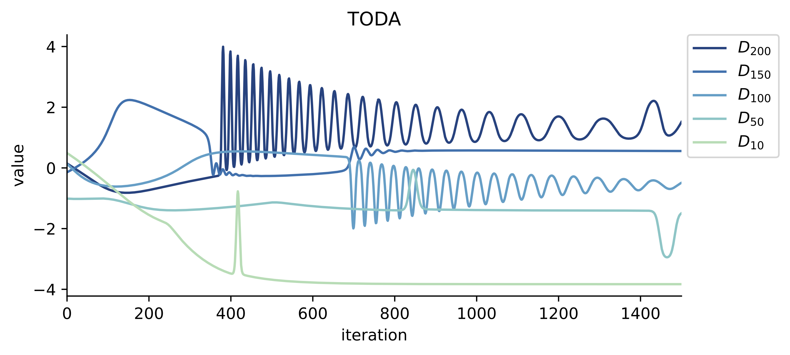

# Diagonalizing matrix flows

This repo contains a Python notebook for diagonalizing matrix flows, as described in a [paper by Khesin and Modin](https://arxiv.org/abs/2207.10214) (the notebook was used to generate all the figures in that paper). Three different gradient matrix flows are studied: the Toda flow, the incompressible porous medium equation (spatially discretized via quantization), and a new diagonalizing flow that does not strive to sort the diagonal elements.

To run the notebook the following modules are needed:
- `numpy` and `scipy`
- `matplotlib` (linked to `ffmpeg` for creating movies)
- [`quflow`](https://github.com/klasmodin/quflow)
- `h5py`

Here is the [HTML-version](diagonalizing-flows.html) of the notebook (in case you cannot run Jupyter notebooks but still would like to see the code).

Below you see the animations of the three flows studies, represented as incompressible porous medium equations on the sphere.

## Toda flow (TODA)

https://user-images.githubusercontent.com/2172666/213688544-d7e0b413-cde8-40b5-b7ba-6c9688c71e8f.mp4

## Incompressible porous medium (IPM)

https://user-images.githubusercontent.com/2172666/213688740-4e2502db-1c1b-4d0a-9cfb-73bfe20c7f04.mp4

## Diagonalizing incompressible flow (DIAG)

https://user-images.githubusercontent.com/2172666/213688881-63be6bf5-de86-4682-801a-0ef7c53fe8c9.mp4

